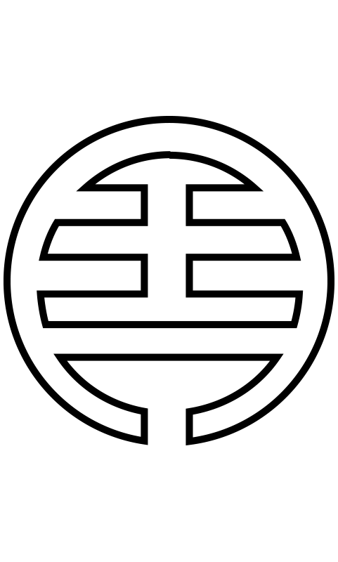

## badges

<p align="center">
    
</p>

<p align="center">
    To make badges more standard and acceptable.
</p>

[](https://rawgit.com/aleen42/badges/master/src/badges.svg)

A collection of badges designed for personal repositories, and I hope that all of these badges can be widely accepted and used in the document of any project so that they can become more and more standard. If you also have some new ideas about badges, just open an issue. Always remember that: **More than a coder, more than a designer.**

So how to create such cute badges? It's very simple. As it's only registered on [npm](https://www.npmjs.com/), you should install it by typing:

```bash
sudo npm install -g badges-cli
```

Then you can use this command line tool for creating badges yourself:

```bash
badge -t Alipay -c 1CACEB -p alipay.svg -o output.svg
```

To uninstall the tool, you can just uninstall it by typing:

```bash
sudo npm uninstall -g badges-cli
```

> Note that: because of the problem of text width calculating has not been worked around, it's only supported ASCII characters to generate.

### Coder

- [](https://rawgit.com/aleen42/badges/master/src/hacker.svg) A badge used for hacking projects (**Business Using is not allowed**)
- [](https://rawgit.com/aleen42/badges/master/src/github.svg) A badge used for GitHub repositories
- [](https://rawgit.com/aleen42/badges/master/src/npm.svg) A badge used for npm packages
- [](https://rawgit.com/aleen42/badges/master/src/vue.svg) A badge used for repositories which has used the framework, Vue
- [](https://rawgit.com/aleen42/badges/master/src/react.svg) A badge used for repositories which has used the framework, React
- [](https://rawgit.com/aleen42/badges/master/src/redux.svg) A badge used for projects using React Redux
- [](https://rawgit.com/aleen42/badges/master/src/router.svg) A badge used for projects using React Router
- [](https://rawgit.com/aleen42/badges/master/src/angular.svg) A badge used for repositories which has used the framework, Angular
- [](https://rawgit.com/aleen42/badges/master/src/eslint.svg) A badge used for projects using ESLint
- [](https://rawgit.com/aleen42/badges/master/src/gitbook.svg) A badge used for Gitbook projects
- [](https://rawgit.com/aleen42/badges/master/src/atom.svg) A badge for the Atom editor
- [](https://rawgit.com/aleen42/badges/master/src/sublime.svg) A badge for the Sulime Text editor
- [](https://rawgit.com/aleen42/badges/master/src/visual_studio.svg) A badge for the Visual Studio IDE
- [](https://rawgit.com/aleen42/badges/master/src/bower.svg) A badge used for bower packages
- [](https://rawgit.com/aleen42/badges/master/src/gulp.svg) A badge used for projects using gulp to build
- [](https://rawgit.com/aleen42/badges/master/src/grunt.svg) A badge used for projects using grunt to build
- [](https://rawgit.com/aleen42/badges/master/src/apiary.svg) A badge used for documents written on Apiary
- [](https://rawgit.com/aleen42/badges/master/src/docker.svg) A badge used for projects deployed on Docker
- [](https://rawgit.com/aleen42/badges/master/src/codepen.svg) A badge used for projects running on CodePen
- [](https://rawgit.com/aleen42/badges/master/src/jsfiddle.svg) A badge used for projects running on JSFiddle
- [](https://rawgit.com/aleen42/badges/master/src/slack.svg) A badge used for projects discussed on Slack
- [](https://rawgit.com/aleen42/badges/master/src/node.svg) A badge used for projects built with Node.js
- [](https://rawgit.com/aleen42/badges/master/src/webpack.svg) A badge used for projects built with Webpack

### Community

- [](https://rawgit.com/aleen42/badges/master/src/facebook.svg) A badge used for sharing communities on Facebook
- [](https://rawgit.com/aleen42/badges/master/src/twitter.svg) A badge used for sharing communities on Twitter
- [](https://rawgit.com/aleen42/badges/master/src/pinterest.svg) A badge used for sharing communities on Pinterest
- [](https://rawgit.com/aleen42/badges/master/src/google_plus.svg) A badge used for sharing communities on Google+
- [](https://rawgit.com/aleen42/badges/master/src/sina_weibo.svg) A badge used for sharing communities on Sina Weibo
- [](https://rawgit.com/aleen42/badges/master/src/medium.svg) A badge used for articles shared on Medium
- [](https://rawgit.com/aleen42/badges/master/src/reddit.svg) A badge used for articles shared on Reddit
- [](https://rawgit.com/aleen42/badges/master/src/stackoverflow.svg) A badge used for references on Stack Overflow
- [](https://rawgit.com/aleen42/badges/master/src/stackexchange.svg) A badge used for references on Stack Exchange
- [](https://rawgit.com/aleen42/badges/master/src/serverfault.svg) A badge used for references on Server Fault
- [](https://rawgit.com/aleen42/badges/master/src/superuser.svg) A badge used for references on Super User
- [](https://rawgit.com/aleen42/badges/master/src/juejin_translation.svg) A badge used for any articles translated by gold-miner

### Communication

- [](https://rawgit.com/aleen42/badges/master/src/messenger.svg) A badge used for sharing communication ways on Messenger
- [](https://rawgit.com/aleen42/badges/master/src/telegram.svg) A badge used for sharing communication ways on Telegram
- [](https://rawgit.com/aleen42/badges/master/src/skype.svg) A badge used for sharing communication ways on Skype
- [](https://rawgit.com/aleen42/badges/master/src/whatsapp.svg) A badge used for sharing communication ways on WhatsApp
- [](https://rawgit.com/aleen42/badges/master/src/line.svg) A badge used for sharing communication ways on Line
- [](https://rawgit.com/aleen42/badges/master/src/wechat.svg) A badge used for sharing communication ways on WeChat

### Multimedia

- [](https://rawgit.com/aleen42/badges/master/src/soundcloud.svg) A badge used for music shared on SoundCloud
- [](https://rawgit.com/aleen42/badges/master/src/spotify.svg) A badge used for music shared on Spotify

### Inc

- [](https://rawgit.com/aleen42/badges/master/src/xitu.svg) A badge used for any articles of Xitu Inc., including translations
- [](https://rawgit.com/aleen42/badges/master/src/codrops.svg) A badge used for any project of Codrops Inc.
- [](https://rawgit.com/aleen42/badges/master/src/soundtooth.svg) A badge used for any project of Soundtooth Inc.
- [](https://rawgit.com/aleen42/badges/master/src/alipay.svg) A badge used for the Alipay Inc.
-  A badge used for projects of NASA
- [](https://rawgit.com/aleen42/badges/master/src/amazon.svg) A badge used for the Amazon Inc.
- [](https://rawgit.com/aleen42/badges/master/src/paypal.svg) A badge used for the Paypal Inc.
- [](https://rawgit.com/aleen42/badges/master/src/patreon.svg) A badge used for the Patreon Inc.
- [](https://rawgit.com/aleen42/badges/master/src/bitcoin.svg) A badge used for the Bitcoin Inc.

### Game

- [](https://rawgit.com/aleen42/badges/master/src/steam.svg) A badge used for any game supported on the platform Steam
- [](https://rawgit.com/aleen42/badges/master/src/ingress.svg) A badge used for the game Ingress published by Niantic Inc.
- [](https://rawgit.com/aleen42/badges/master/src/osu.svg) A badge used for the game osu! published by ppy

### Designer

- [](https://rawgit.com/aleen42/badges/master/src/behance.svg) A badge used for designing projects sharing on Behance
- [](https://rawgit.com/aleen42/badges/master/src/photoshop.svg) A badge used for designing projects using Photoshop as a tool
- [](https://rawgit.com/aleen42/badges/master/src/illustration.svg) A badge used for designing projects using Illustration as a tool
- [](https://rawgit.com/aleen42/badges/master/src/dreamweaver.svg) A badge used for projects using Dreamweaver as a tool
- [](https://rawgit.com/aleen42/badges/master/src/after_effect.svg) A badge used for designing projects using After Effect as a tool
- [](https://rawgit.com/aleen42/badges/master/src/premiere.svg) A badge used for designing projects using Premiere as a tool
- [](https://rawgit.com/aleen42/badges/master/src/flash.svg) A badge used for designing projects using Flash as a tool
- [](https://rawgit.com/aleen42/badges/master/src/zeplin.svg) A badge used for designing projects with Zeplin

#### :fuelpump: How to contribute

Have an idea? Found a bug? See [how to contribute](https://aleen42.gitbooks.io/personalwiki/content/contribution.html).

#### :scroll: License

[MIT](https://aleen42.gitbooks.io/personalwiki/content/MIT.html) © aleen42
