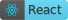
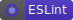
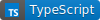
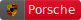
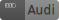
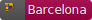

## badges

<p align="center">
    
</p>

<p align="center">To make badges more standard and acceptable.</p>

<br />
<br />
<br />

  

Alternative: [**default**](./README.md), [**flat-square**](./README_flat_square.md), [**dynamic-fore-color**](./README_dfc.md), [**dynamic-fore-color (flat_square)**](./README_flat_square_dfc.md).

A collection of badges designed for personal repositories, and I hope that all of these badges can be widely accepted and used in the document of any project so that they can become more and more standard. If you also have some new ideas about badges, just open an issue. Always remember that: **More than a coder, more than a designer.**

So how to create such cute badges? It's very simple. As it's only registered on [npm](https://www.npmjs.com/), you should install it by typing:

```bash
sudo npm install -g badges-cli
```

Then you can use this command line tool for creating badges yourself:

Take the following command as an example, `t` means text content, and `c` means color. If you want to create a badge with SVG sources, you can specify with `p` to tell the tool where to find your sources. Finally, `o` is used to specify where to export the badge.

```bash
badge -t Alipay -c "#1CACEB" -p alipay.svg --dynamic-fore-color -o output.svg
```

One more thing, according to [the suggestion](https://github.com/facebook/jest/issues/5438#issuecomment-362553867) during creating badges for Jest, this tool has been extended to support skins with `s` to specify, which value can be "light" or "dark" temporarily at this moment.

To uninstall the tool, you can just uninstall it by typing:

```bash
sudo npm uninstall -g badges-cli
```

As for how to create a badge and add it in the collection? There are some steps you may need to follow:

1. Fork the repository
2. Install `badges-cli`
3. Create a logo with SVG formatted (**recommended**), or any other formats like PNG. (_**The logo should be wrapped into a square, in another word, the width should be equal to the height, or it would have been horizontally squished.**_)
4. Save the logo in the folder `dist`
5. Add data for your badge in the file `script/data.js`
    ```js
   const data = { 
        // ...
        'React Router': {
            fileName: 'router.svg',
            color: '62DAFB',
            description: 'A badge used for projects using React Router'
        }
    };
    ```
5. Run the script by typing `npm run build`
6. If succeed, the readme file will be automatically updated
7. Finally, push all updates and create a pull request for your change
8. **Done!!**

> Note that: so far haven't I thought out a perfect solution for calculating width of text accurately yet, and it means that the text can not be aligned in some cases.

*Note: if you really like this project, feel free to buy me a swimming chance:*

[](http://paypal.me/aleen42) [](https://www.patreon.com/aleen42) [](https://www.patreon.com/aleen42)

### Coder

- [](https://aleen42.github.io/badges/src/angular_dfc.svg) A badge used for repositories which has used the framework, Angular
- [](https://aleen42.github.io/badges/src/npm_dfc.svg) A badge used for npm packages
- [](https://aleen42.github.io/badges/src/gulp_dfc.svg) A badge used for projects using Gulp to build
- [](https://aleen42.github.io/badges/src/react_dfc.svg) A badge used for repositories which has used the framework, React
- [](https://aleen42.github.io/badges/src/router_dfc.svg) A badge used for projects using React Router
- [](https://aleen42.github.io/badges/src/modernizr_dfc.svg) A badge for projects using Modernizr
- [](https://aleen42.github.io/badges/src/reactivex_dfc.svg) A badge for projects using ReactiveX
- [](https://aleen42.github.io/badges/src/jest_1_dfc.svg) A badge used for projects using Jest for testing JavaScript
- [](https://aleen42.github.io/badges/src/jest_2_dfc.svg) A badge used for projects using Jest for testing JavaScript
- [](https://aleen42.github.io/badges/src/jasmine_dfc.svg) A badge used for projects using Jasmine for testing JavaScript
- [](https://aleen42.github.io/badges/src/visual_studio_dfc.svg) A badge for the Visual Studio IDE
- [](https://aleen42.github.io/badges/src/visual_studio_code_dfc.svg) A badge for the Visual Studio Code IDE
- [](https://aleen42.github.io/badges/src/qunit_dfc.svg) A badge for projects using QUnit for unit tests
- [](https://aleen42.github.io/badges/src/redux_dfc.svg) A badge used for projects using React Redux
- [](https://aleen42.github.io/badges/src/eslint_dfc.svg) A badge used for projects using ESLint
- [](https://aleen42.github.io/badges/src/gitbook_1_dfc.svg) A badge used for books publish by Gitbook
- [](https://aleen42.github.io/badges/src/gitbook_2_dfc.svg) A badge used for books publish by Gitbook
- [](https://aleen42.github.io/badges/src/node_dfc.svg) A badge used for projects built with Node.js
- [](https://aleen42.github.io/badges/src/vue_dfc.svg) A badge used for repositories which has used the framework, Vue
- [](https://aleen42.github.io/badges/src/vuepress_dfc.svg) A badge used for books publish by Vuepress
- [](https://aleen42.github.io/badges/src/gitter_dfc.svg) A badge used for projects can be discussed on Gitter
- [](https://aleen42.github.io/badges/src/atom_dfc.svg) A badge for the Atom editor
- [](https://aleen42.github.io/badges/src/sublime_text_dfc.svg) A badge for the Sulime Text editor
- [](https://aleen42.github.io/badges/src/tensorflow_dfc.svg) A badge use for projects using Tensorflow
- [](https://aleen42.github.io/badges/src/bower_dfc.svg) A badge used for bower packages
- [](https://aleen42.github.io/badges/src/gitlab_dfc.svg) A badge used for Gitlab repositories
- [](https://aleen42.github.io/badges/src/grunt_dfc.svg) A badge used for projects using grunt to build
- [](https://aleen42.github.io/badges/src/rss_dfc.svg) A badge used for RSS subscribing
- [](https://aleen42.github.io/badges/src/javascript_dfc.svg) A badge used for projects that coded with JavaScript
- [](https://aleen42.github.io/badges/src/mocha_dfc.svg) A badge used for projects using Mocha for unit tests
- [](https://aleen42.github.io/badges/src/apiary_dfc.svg) A badge used for documents written on Apiary
- [](https://aleen42.github.io/badges/src/docker_dfc.svg) A badge used for projects deployed on Docker
- [](https://aleen42.github.io/badges/src/typescript_dfc.svg) A badge used for projects that coded with TypeScript
- [](https://aleen42.github.io/badges/src/jsfiddle_dfc.svg) A badge used for projects running on JSFiddle
- [](https://aleen42.github.io/badges/src/webpack_dfc.svg) A badge used for projects built with Webpack
- [](https://aleen42.github.io/badges/src/slack_dfc.svg) A badge used for projects discussed on Slack
- [](https://aleen42.github.io/badges/src/idea_dfc.svg) A badge for the IDEA editor
- [](https://aleen42.github.io/badges/src/codepen_dfc.svg) A badge used for projects running on CodePen
- [](https://aleen42.github.io/badges/src/hacker_dfc.svg) A badge used for hacking projects (**Business Using is not allowed)**
- [](https://aleen42.github.io/badges/src/github_dfc.svg) A badge used for GitHub repositories


### Community

- [](https://aleen42.github.io/badges/src/juejin_translation_dfc.svg) A badge used for any articles translated by gold-miner
- [](https://aleen42.github.io/badges/src/facebook_dfc.svg) A badge used for sharing communities on Facebook
- [](https://aleen42.github.io/badges/src/stackexchange_dfc.svg) A badge used for references on Stack Exchange
- [](https://aleen42.github.io/badges/src/superuser_dfc.svg) A badge used for references on Super User
- [](https://aleen42.github.io/badges/src/twitter_dfc.svg) A badge used for sharing communities on Twitter
- [](https://aleen42.github.io/badges/src/google_plus_dfc.svg) A badge used for sharing communities on Google+
- [](https://aleen42.github.io/badges/src/pinterest_dfc.svg) A badge used for sharing communities on Pinterest
- [](https://aleen42.github.io/badges/src/sina_weibo_dfc.svg) A badge used for sharing communities on Sina Weibo
- [](https://aleen42.github.io/badges/src/reddit_dfc.svg) A badge used for articles shared on Reddit
- [](https://aleen42.github.io/badges/src/stackoverflow_dfc.svg) A badge used for GitHub repositories
- [](https://aleen42.github.io/badges/src/medium_dfc.svg) A badge used for articles shared on Medium
- [](https://aleen42.github.io/badges/src/serverfault_dfc.svg) A badge used for references on Server Fault


### Communication

- [](https://aleen42.github.io/badges/src/messenger_dfc.svg) A badge used for sharing communication ways on Messenger
- [](https://aleen42.github.io/badges/src/telegram_dfc.svg) A badge used for sharing communication ways on Telegram
- [](https://aleen42.github.io/badges/src/skype_dfc.svg) A badge used for sharing communication ways on Skype
- [](https://aleen42.github.io/badges/src/whatsapp_dfc.svg) A badge used for sharing communication ways on WhatsApp
- [](https://aleen42.github.io/badges/src/line_dfc.svg) A badge used for sharing communication ways on Line
- [](https://aleen42.github.io/badges/src/wechat_dfc.svg) A badge used for sharing communication ways on WeChat
- [](https://aleen42.github.io/badges/src/lunkr_dfc.svg) A badge used for sharing communication ways on Coremail Lunkr


### Multimedia

- [](https://aleen42.github.io/badges/src/soundcloud_dfc.svg) A badge used for music shared on SoundCloud
- [](https://aleen42.github.io/badges/src/spotify_dfc.svg) A badge used for music shared on Spotify


### Inc

- [](https://aleen42.github.io/badges/src/nasa_dfc.svg) A badge used for projects of NASA
- [](https://aleen42.github.io/badges/src/codrops_dfc.svg) A badge used for any project of Codrops Inc.
- [](https://aleen42.github.io/badges/src/xitu_dfc.svg) A badge used for any articles of Xitu Inc.
- [](https://aleen42.github.io/badges/src/coremail_dfc.svg) A badge used for the Coremail Inc.
- [](https://aleen42.github.io/badges/src/soundtooth_dfc.svg) A badge used for any project of Soundtooth Inc.
- [](https://aleen42.github.io/badges/src/amazon_dfc.svg) A badge used for the Amazon Inc.
- [](https://aleen42.github.io/badges/src/bitcoin_dfc.svg) A badge used for the Bitcoin Inc.
- [](https://aleen42.github.io/badges/src/airbnb_dfc.svg) A badge used for the Airbnb Inc.
- [](https://aleen42.github.io/badges/src/monsoon_dfc.svg) A badge used for the Monsoon Inc.


### Sponsors

- [](https://aleen42.github.io/badges/src/paypal_dfc.svg) A badge used for Paypal sponsors.
- [](https://aleen42.github.io/badges/src/alipay_dfc.svg) A badge used for Alipay sponsors.
- [](https://aleen42.github.io/badges/src/patreon_dfc.svg) A badge used for Patreon sponsors.
- [](https://aleen42.github.io/badges/src/buymeacoffee_dfc.svg) A badge used for BuyMeACoffee sponsors.
- [](https://aleen42.github.io/badges/src/issuehunt_dfc.svg) A badge used for IssueHunt sponsors.


### Car

- [](https://aleen42.github.io/badges/src/lamborghini_dfc.svg) A badge used for cars of Lamborghini
- [](https://aleen42.github.io/badges/src/bugatti_dfc.svg) A badge used for cars of Bugatti
- [](https://aleen42.github.io/badges/src/porsche_dfc.svg) A badge used for cars of Porsche
- [](https://aleen42.github.io/badges/src/tesla_dfc.svg) A badge used for cars of Tesla
- [](https://aleen42.github.io/badges/src/ferrari_dfc.svg) A badge used for cars of Ferrari
- [](https://aleen42.github.io/badges/src/toyota_dfc.svg) A badge used for cars of Toyota
- [](https://aleen42.github.io/badges/src/mitsubishi_dfc.svg) A badge used for cars of Mitsubishi
- [](https://aleen42.github.io/badges/src/maserati_dfc.svg) A badge used for cars of Maserati
- [](https://aleen42.github.io/badges/src/marussia_dfc.svg) A badge used for cars of Marussia
- [](https://aleen42.github.io/badges/src/koenigsegg_dfc.svg) A badge used for cars of Koenigsegg
- [](https://aleen42.github.io/badges/src/bmw_dfc.svg) A badge used for cars of BMW
- [](https://aleen42.github.io/badges/src/land_rover_dfc.svg) A badge used for cars of Land Rover
- [](https://aleen42.github.io/badges/src/mercedes_benz_dfc.svg) A badge used for cars of Mercedes Benz
- [](https://aleen42.github.io/badges/src/audi_dfc.svg) A badge used for cars of Audi


### Football Clubs

- [](https://aleen42.github.io/badges/src/liverpool_dfc.svg) A badge used for FC Liverpool
- [](https://aleen42.github.io/badges/src/real_madrid_dfc.svg) A badge used for FC Real Madrid
- [](https://aleen42.github.io/badges/src/manchester_united_dfc.svg) A badge used for FC Manchester United
- [](https://aleen42.github.io/badges/src/arsenal_dfc.svg) A badge used for FC Arsenal
- [](https://aleen42.github.io/badges/src/ac_milan_dfc.svg) A badge used for FC AC Milan
- [](https://aleen42.github.io/badges/src/bayern_munchen_dfc.svg) A badge used for FC Bayern Munchen
- [](https://aleen42.github.io/badges/src/barcelona_dfc.svg) A badge used for FC Barcelona
- [](https://aleen42.github.io/badges/src/chelsea_dfc.svg) A badge used for FC Chelsea


### Game

- [](https://aleen42.github.io/badges/src/steam_dfc.svg) A badge used for any game supported on the platform Steam
- [](https://aleen42.github.io/badges/src/ingress_dfc.svg) A badge used for the game Ingress published by Niantic Inc.
- [](https://aleen42.github.io/badges/src/osu_dfc.svg) A badge used for the game osu! published by ppy


### Designer

- [](https://aleen42.github.io/badges/src/behance_dfc.svg) A badge used for designing projects sharing on Behance
- [](https://aleen42.github.io/badges/src/photoshop_dfc.svg) A badge used for designing projects using Photoshop as a tool
- [](https://aleen42.github.io/badges/src/illustrator_dfc.svg) A badge used for designing projects using Illustrator as a tool
- [](https://aleen42.github.io/badges/src/dreamweaver_dfc.svg) A badge used for projects using Dreamweaver as a tool
- [](https://aleen42.github.io/badges/src/after_effects_dfc.svg) A badge used for designing projects using After Effect as a tool
- [](https://aleen42.github.io/badges/src/premiere_dfc.svg) A badge used for designing projects using Premiere as a tool
- [](https://aleen42.github.io/badges/src/flash_dfc.svg) A badge used for designing projects using Flash as a tool
- [](https://aleen42.github.io/badges/src/zeplin_dfc.svg) A badge used for designing projects with Zeplin

### :fuelpump: How to contribute

Have an idea? Found a bug? See [how to contribute](https://aleen42.github.io/PersonalWiki/contribution.html).

### :scroll: License

[MIT](https://aleen42.github.io/PersonalWiki/MIT.html) © aleen42
